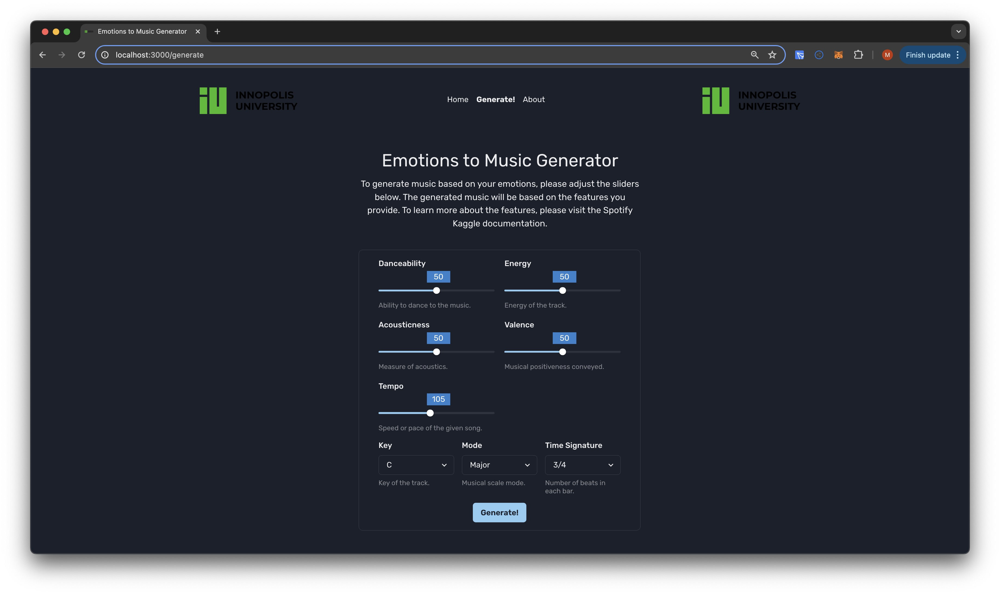

# From Emotions To Music: AI powerd music generation based on LSTM and FIGARO

This repository contains all the code and results of our project, which aims to generate music using emotional features (energy, valence, ...). All the necessary details are in the [report](./report.pdf).

## Folder structure

The repository is organized as follows:

- `/api` : Our Flask API that allows web users to use our pipeline.
- `/emotion-to-music-frontend`: The UI of our end-user tool
- `/dataset` : Our training dataset
- `/data_collection` : The scripts used to merge the dataset for training.
- `/original_figaro`: Contains the original FIGARO Jupyter notebook which we used for our pipeline.
- `/model_training`: All code, results and checkpoints related to our trained models.
